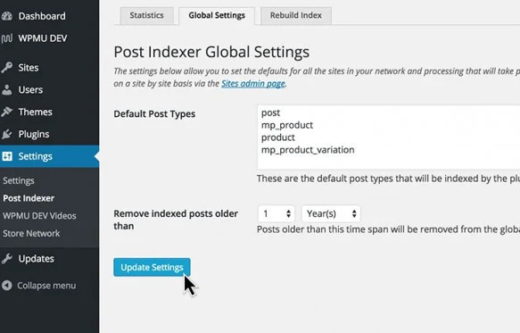

<link rel="stylesheet" href="assets/style.css">

<h2 align="center" style="color:#38c2bb;">🚀 PS Multisite Index – Die zentrale Lösung für Dein Netzwerk</h2>

  <a href="https://github.com/Power-Source/ps-postindexer/releases" style="color:#38c2bb;">📝 Download</a>
  <a href="erweiterungen.html" style="color:#38c2bb;">📖 Erweiterungen</a>

## Was ist der PS Multisite Index?

Der PS Multisite Index ist die neue Schaltzentrale für Content-Indexierung, Statistiken und Monitoring in WordPress Multisites. Früher war für viele Funktionen eine Vielzahl von Plugins nötig – heute sind alle wichtigen Erweiterungen (Extensions) direkt integriert. Behalte jederzeit den Überblick über alle Inhalte, Post-Typen, Kommentare und Aktivitäten in Deinem Netzwerk.

### Highlights & Features

- Integrierte Extensions für Suche, globale Widgets, Feeds, Tags, Kommentare, Aktivitäten und mehr – alles direkt im Plugin
- Umfassende Statistiken und Monitoring-Tools für Beiträge, Seiten, Kommentare und Aktivitäten
- Übersichtliche Dashboards und Diagramme für Admins und Netzwerkbetreiber
- Flexible Steuerung: Wähle, was und wie indiziert wird (inkl. Ausschlüsse, Sofort-Indexierung, Zeitrahmen, Beitragstypen)
- Unterstützung für verschiedene Content-Typen (Posts, Seiten, Kommentare, Custom Post Types)
- Volle Kompatibilität mit modernen WordPress-Versionen und Multisite-Setups
- Mehrsprachigkeit: de_DE, en_US, fr_FR, it_IT, el

### Vorteile für Admins & Netzwerkbetreiber

- Zentrale Verwaltung und Analyse aller Inhalte im Netzwerk
- Keine Abhängigkeit mehr von externen Plugins
- Sofortiger Zugriff auf aktuelle Statistiken und Trends
- Einfache Bedienung und moderne Oberfläche
- Erweiterbar durch eigene Extensions

---

## Dashboard & Bedienung

Das übersichtliche Dashboard bietet Dir alle wichtigen Statistiken und Einstellungen auf einen Blick. Wähle gezielt aus, welche Seiten und Beitragstypen indiziert werden, steuere die Index-Lebensdauer und analysiere die Aktivität im Netzwerk.

### Individuelle Steuerung pro Webseite

- Indexierung für einzelne Seiten aktivieren/deaktivieren
- Einstellungen und Statistiken pro Seite
- Index gezielt für einzelne Seiten neu aufbauen

---

## Erweiterungen & Tools

Alle wichtigen Tools und Erweiterungen sind jetzt direkt im Plugin enthalten:

- Globale Suche & Widgets
- Globale Feeds & Tags
- Kommentar-Indexing (optional)
- Live-Stream & User-Reports
- Umfangreiche Statistik- und Monitoring-Module

Weitere Extensions können einfach ergänzt werden.

---

## Installation & Erste Schritte

1. Plugin installieren und netzwerkweit aktivieren
2. Dashboard im Netzwerk-Admin unter **Einstellungen > Multisite Index** aufrufen
3. Einstellungen anpassen, Index aufbauen und loslegen!

---

## Praxisbeispiele & Alternativlosigkeit

Der PS Multisite Index ist die zentrale Lösung für alle Netzwerke, in denen Inhalte, Statistiken und Monitoring über Webseiten-Grenzen hinweg benötigt werden. Hier einige typische Einsatzszenarien:

### Beispiel 1: Community- oder Bildungsnetzwerke

In großen Community- oder Schulnetzwerken mit vielen Subsites (z. B. für Klassen, Kurse, Vereine) ist es essenziell, Beiträge, Seiten und Kommentare netzwerkweit zu durchsuchen, zu filtern und auszuwerten. Nur der PS Multisite Index bietet:
- Zentrale Suche und globale Feeds
- Übersicht über alle Aktivitäten und Content-Typen
- Flexible Steuerung, welche Seiten und Inhalte indiziert werden

### Beispiel 2: Unternehmensnetzwerke & Intranets

Unternehmen mit Multisite-Intranet-Strukturen profitieren von:
- Netzwerkweiter Inhaltsanalyse und Monitoring
- Statistiken zu Beiträgen, Seiten und Nutzeraktivitäten
- Einfache Verwaltung und Kontrolle über alle Standorte hinweg

### Beispiel 3: Multisite-Blogs & Publishing-Plattformen

Für große Blognetzwerke oder Publishing-Plattformen ist der PS Multisite Index unverzichtbar, um:
- Globale Widgets und Feeds für aktuelle Beiträge/Kommentare bereitzustellen
- Trends und Top-Inhalte netzwerkweit sichtbar zu machen
- Die Performance und Index-Qualität zentral zu überwachen

### Beispiel 4: Individuelle Lösungen & Erweiterungen

Dank der offenen Architektur und der integrierten Extensions ist der PS Multisite Index auch die perfekte Basis für eigene Erweiterungen, z. B. für E-Commerce-Netzwerke, Mitgliederportale oder Speziallösungen.

> **Fazit:** Überall dort, wo Inhalte, Statistiken und Monitoring netzwerkweit gebraucht werden, ist der PS Multisite Index die einzige wirklich zentrale, flexible und zukunftssichere Lösung.

---

> ❤️ Entwickelt mit Liebe von [PSOURCE](https://github.com/Power-Source)
